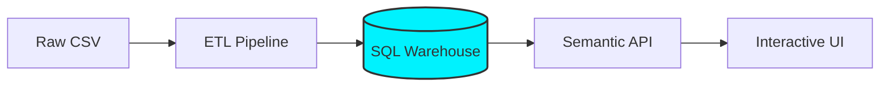

# ✧ Revenue Analytics Pipeline & Visualization System

**An Enterprise-Grade Transformation: From Messy CSVs to a High-Performance SQL Warehouse.**

---

## 🎯 The Mission
In the real world, data is messy. This project demonstrates a complete engineering lifecycle: taking raw, "dirty" retail records and transforming them into a production-ready, SQL-backed analytics system. 



This isn't just a dashboard; it's a **modernized data pipeline** designed for speed, reliability, and scale.

---

## 🚀 The "Before & After" (Modernization)
I intentionally built this project to showcase a **migration from Legacy to Modern architecture**:

*   **Legacy (CSV-Based):** Originally, the system read directly from a flat CSV file. It was slow, lacked data types, and couldn't scale.
*   **Modern (SQL-Warehouse):** I engineered a custom ETL pipeline (`public/pipeline/to_sqlite.py`) that cleans the data and migrates it into a structured **SQLite Warehouse**.

> [!TIP]
> **Check the "Source Toggle" in the dashboard!** You can literally flip a switch to see the difference between the legacy CSV engine and the new SQL-powered brain.

---

## 🛠️ Key Engineering Features
*   **SQL Semantic Layer:** Metric logic (like Revenue and Margin) is locked in the backend SQL, preventing "calculation drift" in the UI.
*   **High-Performance Indexing:** Added B-Tree indexing on date columns to ensure sub-millisecond filtering even as the dataset grows.
*   **Deep-Linking State:** The dashboard state is synced with the URL. You can filter for a specific region and date, then copy the link to share that exact view.
*   **Automated Data Audit:** Includes a "Self-Healing" pipeline that identifies and logs corrupted records into a validation report rather than letting them break the app.

---

## 💻 Tech Stack
*   **Backend:** Python 3 (Standard Library + Pandas for ETL)
*   **Database:** SQLite3 (Warehouse with B-Tree Indexing)
*   **Frontend:** Vanilla JS (ES6+), Modern CSS (Glassmorphism & Skeleton Loaders)
*   **Deployment:** Ready for Render / GitHub Actions

---

## ⚡ Quick Start
1.  **Clone the repo:**
    ```bash
    git clone https://github.com/yourusername/revenue-analytics-system.git
    cd revenue-analytics-system
    ```
2.  **Install dependencies:**
    ```bash
    pip install -r requirements.txt
    ```
3.  **Run the ETL + data audit (writes to `data/`):**
    ```bash
    python public/pipeline/run_pipeline.py
    ```
4.  **Migrate to the SQLite warehouse (rebuilds `data/warehouse.db`):**
    ```bash
    python public/pipeline/to_sqlite.py
    ```

    > The warehouse stores `order_date` as `YYYY-MM-DD` for correct SQL filtering and fast indexing.

5.  **Launch the Dashboard:**
    ```bash
    python server/server.py
    ```
6.  **Visit:** `http://localhost:8787`

---

## 📬 Contact / Portfolio
*   **Name:** [Your Name]
*   **Focus:** Analytics Engineering / Data Pipeline Architecture
*   **LinkedIn:** [Your Link]

---

**Tags:** #DataEngineering #SQL #Python #ETL #Analytics #WebDevelopment #SQLite
